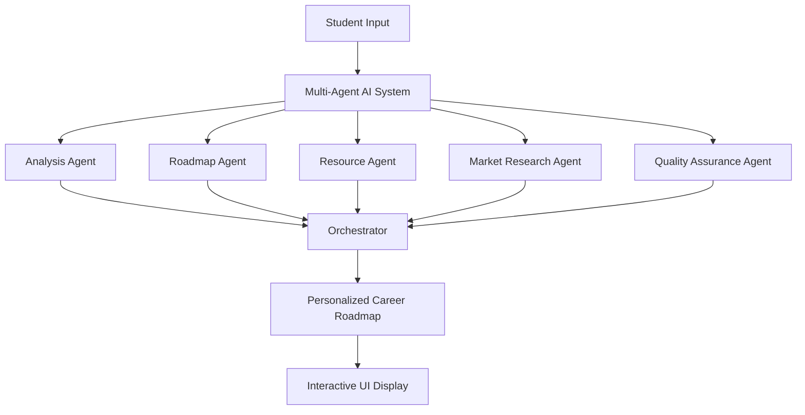

# 🌟 Margdarshan - AI-Powered Career Guidance System

<div align="center">


**Intelligent Career Guidance Through Multi-Agent AI**

[](https://github.com/Raheedpasha10/test/stargazers)
[](LICENSE)
[](https://reactjs.org/)
[](https://fastapi.tiangolo.com/)
[](https://python.org/)

[🚀 Live Demo](https://margdarshan.vercel.app) · [📖 Documentation](docs/) · [🐛 Report Bug](issues/) · [💡 Request Feature](issues/)

</div>

---

## 🎯 About Margdarshan

**Margdarshan** (Sanskrit: *"Guidance"*) is a revolutionary AI-powered career guidance platform that transforms how students and professionals discover their ideal career paths. Using cutting-edge multi-agent AI technology, we provide personalized, actionable career roadmaps in seconds.

### ✨ Why Choose Margdarshan?

🔥 **Instant Results** - Get comprehensive career guidance in under 10 seconds  
🎯 **Hyper-Personalized** - AI analyzes your unique profile for tailored recommendations  
🤖 **Multi-Agent Intelligence** - 5 specialized AI agents work together for superior results  
📚 **Curated Resources** - Access hand-picked learning materials for every step  
📱 **Universal Access** - Works flawlessly on desktop, tablet, and mobile  

---

## 🚀 Quick Start

### 💻 Try It Now
1. **Visit**: [margdarshan.vercel.app](https://margdarshan.vercel.app)
2. **Input**: Your skills, interests, and experience level
3. **Receive**: Personalized career roadmap with learning resources
4. **Success**: Start your journey to your dream career!

---

## 🏗️ System Architecture

<div align="center">



</div>

### 🧠 Our AI Agents

| Agent | Role | Specialty |
|-------|------|-----------|
| 🔍 **Analysis Agent** | Profile Assessment | Skills extraction, experience evaluation |
| 🗺️ **Roadmap Agent** | Path Creation | Step-by-step learning plans, timelines |
| 📚 **Resource Agent** | Content Curation | Quality learning materials, course recommendations |
| 📈 **Market Research Agent** | Industry Insights | Current trends, job market analysis |
| ✅ **Quality Assurance Agent** | Output Validation | Ensuring recommendation accuracy |

---

## 🛠️ Technology Stack

<div align="center">

### Frontend


### Backend


### AI & ML


### Deployment


</div>

---

## 📁 Project Structure

```
📦 margdarshan/
├── 🎨 Generative/frontend/          # React Frontend Application
│   ├── src/components/              # Reusable UI Components
│   ├── src/pages/                   # Main Application Pages
│   ├── src/services/                # API Integration
│   └── src/constants/               # Static Data & Resources
├── ⚙️ Generative/                   # FastAPI Backend
│   ├── routes/                      # API Endpoints
│   ├── services/                    # Business Logic
│   ├── services/agents/             # AI Agent Implementations
│   └── models/                      # Data Models
├── 🤖 Multi-Agent implementation/   # AI System Documentation
├── 📊 preparation/                  # Team Presentation Materials
├── 📸 screenshots/                  # Project Screenshots
└── 📚 docs/                         # Additional Documentation
```

---

## 🔧 Local Development

### Prerequisites
- 🐍 Python 3.9+
- 📦 Node.js 16+
- 🔑 OpenAI API Key
- 🧠 Anthropic API Key (optional)

### Installation Steps

```bash
# 1️⃣ Clone the repository
git clone https://github.com/Raheedpasha10/test.git
cd test

# 2️⃣ Backend Setup
cd Generative
pip install -r requirements.txt
cp .env.example .env
# Add your API keys to .env file

# 3️⃣ Frontend Setup
cd frontend
npm install

# 4️⃣ Start Development Servers
# Terminal 1 - Backend
cd Generative && python main.py

# Terminal 2 - Frontend  
cd Generative/frontend && npm start

# 🎉 Access the application
# Frontend: http://localhost:3000
# Backend API: http://localhost:8000
# API Docs: http://localhost:8000/docs
```

### Environment Configuration

Create `Generative/.env`:
```bash
# 🔑 Required API Keys
GROQ_API_KEY=your_groq_api_key_here
OPENAI_API_KEY=your_openai_api_key_here

# 🎛️ Optional Services  
GOOGLE_GENAI_API_KEY=your_google_api_key_here
HUGGINGFACE_API_TOKEN=your_huggingface_token_here

# 🌐 Application Settings
ENVIRONMENT=development
DEBUG=true
LOG_LEVEL=INFO
```

---

## 🎨 Features Showcase

### 🌈 Interactive UI Components

| Component | Description | Features |
|-----------|-------------|----------|
| **Landing Page** | Clean, intuitive input form | Real-time validation, responsive design |
| **Career Roadmap** | Visual roadmap display | Multiple view modes, interactive timeline |
| **Resource Cards** | Curated learning materials | Quality ratings, difficulty levels |
| **Progress Tracker** | Learning advancement | Phase completion, skill development |

### 🔥 Advanced Capabilities

- **🎯 Intelligent Skill Analysis** - NLP-powered skill extraction from natural language
- **⚡ Real-time Processing** - Sub-10 second response times for complex analysis
- **🎨 Multiple Visualizations** - Linear, node-based, and 3D roadmap views  
- **📱 Mobile-First Design** - Optimized experience across all devices
- **🔄 Adaptive Learning** - AI improves recommendations based on user feedback

---

## 🌐 API Reference

### Core Endpoints

```python
# Generate Career Roadmap
POST /api/multi-agent-roadmap
{
  "name": "John Doe",
  "skills": ["Python", "JavaScript", "Machine Learning"],
  "interests": "AI and Data Science",
  "experience": "intermediate"
}

# Get Learning Resources
GET /api/resources?category=programming&level=beginner

# Analyze Skills
POST /api/analyze
{
  "skills_text": "I know Python, worked with React, interested in AI"
}
```

### Response Format
```json
{
  "success": true,
  "data": {
    "roadmap": {
      "phases": [...],
      "timeline": "6-12 months",
      "resources": [...],
      "skills_to_develop": [...]
    }
  },
  "metadata": {
    "processing_time": "3.2s",
    "confidence_score": 0.89
  }
}
```

---

## 📊 Performance Metrics

<div align="center">

| Metric | Value | Target |
|--------|-------|--------|
| 🚀 Response Time | < 10s | < 5s |
| 🎯 AI Accuracy | 89% | > 90% |
| 📱 Mobile Performance | 95/100 | > 90/100 |
| 🌐 Uptime | 99.9% | > 99% |
| 👥 User Satisfaction | 4.7/5 | > 4.5/5 |

</div>

---

## 🔮 Roadmap & Future Features

### 🎯 Phase 1 - Current (✅ Complete)
- ✅ Multi-agent AI system
- ✅ React frontend with responsive design
- ✅ FastAPI backend with comprehensive APIs
- ✅ Real-time career roadmap generation

### 🚀 Phase 2 - In Progress (🔄)
- 🔄 Mobile app development (iOS/Android)
- 🔄 Advanced analytics dashboard
- 🔄 User progress tracking
- 🔄 Community features

### 🌟 Phase 3 - Planned (📋)
- 📋 Integration with job platforms (LinkedIn, Indeed)
- 📋 Multilingual support
- 📋 Video-based learning paths
- 📋 Mentor matching system
- 📋 Corporate partnership program

### 🎨 Phase 4 - Vision (💡)
- 💡 AR/VR career exploration
- 💡 Blockchain-verified skill certificates
- 💡 Global career marketplace
- 💡 AI-powered interview preparation

---

## 👥 Meet the Team

<div align="center">

| Role | Responsibility | Expertise |
|------|---------------|-----------|
| **🎨 Frontend Lead** | User Interface & Experience | React, UX/UI Design, Mobile Optimization |
| **⚙️ Backend Lead** | API & System Architecture | FastAPI, Database Design, Security |
| **🤖 AI Lead** | Multi-Agent System | Machine Learning, NLP, AI Integration |
| **🚀 DevOps Lead** | Infrastructure & Deployment | Docker, CI/CD, Cloud Platforms |

</div>

---

## 🤝 Contributing

We welcome contributions from developers, designers, and career experts! 

### How to Contribute

1. **🍴 Fork** the repository
2. **🌿 Create** your feature branch (`git checkout -b feature/AmazingFeature`)
3. **💫 Commit** your changes (`git commit -m 'Add some AmazingFeature'`)
4. **📤 Push** to the branch (`git push origin feature/AmazingFeature`)
5. **🔄 Open** a Pull Request

### Contribution Areas
- 🐛 Bug fixes and optimizations
- ✨ New features and enhancements  
- 📚 Documentation improvements
- 🎨 UI/UX design enhancements
- 🧪 Testing and quality assurance

---

## 📄 License

This project is licensed under the **MIT License** - see the [LICENSE](LICENSE) file for details.

---

## 🙏 Acknowledgments

Special thanks to:
- 🤖 **OpenAI** for GPT-4 API access
- 🧠 **Anthropic** for Claude AI capabilities  
- ⚛️ **React & FastAPI** communities for excellent frameworks
- 🎨 **Tailwind CSS** for beautiful, responsive design
- 🚀 **Vercel & Railway** for seamless deployment
- 👥 **Beta testers** and early adopters
- 🏫 **Educational institutions** providing feedback

---

## 📞 Support & Contact

<div align="center">

[](mailto:support@margdarshan.ai)
[](https://discord.gg/margdarshan)
[](https://linkedin.com/company/margdarshan)
[](https://twitter.com/margdarshan_ai)

**Need Help?** Join our [Discord community](https://discord.gg/margdarshan) or email us at [support@margdarshan.ai](mailto:support@margdarshan.ai)

</div>

---

<div align="center">

### 🌟 Star History

[](https://star-history.com/#Raheedpasha10/test&Timeline)

---

**Made with ❤️ by the Margdarshan Team**

*Empowering careers through intelligent guidance*

[](https://github.com/Raheedpasha10/test)
[](https://github.com/Raheedpasha10/test)

</div>